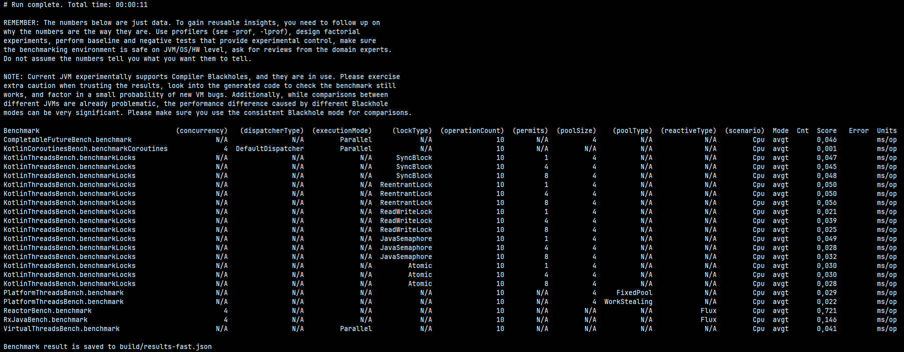

# Real-Life Async Benchmark — Java 21 / Kotlin 2.0

A production-style async/concurrency benchmark suite for Java/Kotlin that compares multiple modern approaches under the same “real-world” workloads.

## What’s included

Comparison across 7 technologies:

- Kotlin Coroutines (launch / async / flow)
- Kotlin Threads (synchronized / locks / atomics)
- Virtual Threads (Project Loom, Java 21+)
- Platform Threads (ExecutorService pools)
- CompletableFuture (async fan-out & pipeline)
- Project Reactor (Mono / Flux / ParallelFlux)
- RxJava 3 (Observable / Flowable variants)

## Quick start

### Prerequisites
- JDK 21 (some benchmarks may require preview features)
- Gradle wrapper included (./gradlew / gradlew.bat)

### Windows: fix console encoding (recommended)

If you see garbled characters in the output (e.g. “Ôëł ... ms/op”), switch the Windows code page to UTF-8 before running Gradle:

CMD:
```
chcp 65001
gradlew jmhFast
```
PowerShell:
```
chcp 65001
.\gradlew jmhFast
```

### Run benchmarks

FAST benchmark (~5 minutes):
```
./gradlew jmhFast
```
MEDIUM benchmark (~20 minutes):
```
./gradlew jmhMedium
```
HIGH benchmark (~60 minutes — full parameter space):
```
./gradlew jmhHigh
```
## Real-world scenarios

Benchmarks simulate typical production workloads:

- Database queries: latency-like work + result handling
- Network calls: simulated call + retry/backoff behavior
- Heavy calculations: CPU-bound math
- Memory allocation: allocation + GC pressure
- File-like processing: simulated file/IO cost

## Benchmark parameters

Each benchmark class exposes @Param configuration such as:

- operationCount (e.g. 10 / 100 / 1000 …)
- concurrency (e.g. 1 / 4 / 8 / 16)
- dispatcher/pool types (depending on technology)

Note: total runtime grows quickly with the number of parameter combinations (cartesian product). jmhFast is meant to run a reduced configuration while still executing each benchmark class.

## Results & ranking

Each run produces a JSON report (see task output). A ranking is also printed to the console:
```
RANKING (AverageTime — lower is better)
--------------------------------------
1  | CompletableFuture [Pipeline] | ...
2  | KotlinThreads [Atomic]       | ...
3  | VirtualThreads [Direct]      | ...
...
```

## Project structure
```
src/main/
├── java/
│   └── benchmark/benchmarks/
│       ├── CompletableFutureBench.java
│       ├── PlatformThreadsBench.java
│       ├── ReactorBench.java
│       ├── RxJavaBench.java
│       └── VirtualThreadsBench.java
└── kotlin/
└── benchmark/
├── benchmarks/
│   ├── KotlinCoroutinesBench.kt
│   └── KotlinThreadsBench.kt
└── scenarios/
├── CpuWorkLoad.kt
├── DbWorkLoad.kt
├── DeterministicRng.kt
├── Hashing.kt
├── MemoryWorkLoad.kt
├── NetworkWorkLoad.kt
├── PseudoFileWorkload.kt
├── RealWorldScenarios.kt
├── RetryPolicy.kt
└── ScenarioConfig.kt
```
## Notes

- Benchmarks use JMH AverageTime (avgt) to measure time per operation.
- Some tasks may enable GC profiling to report allocation rates (slower, but useful).
- Executors/schedulers are initialized in @Setup and shut down in @TearDown where applicable to match server-like lifecycle.

## Issues / contributions

If something looks wrong (hangs, failures, suspicious results), please include:
- OS + JDK version
- the Gradle task used (jmhFast / jmhMedium / jmhHigh)
- console output and/or the JSON report snippet
